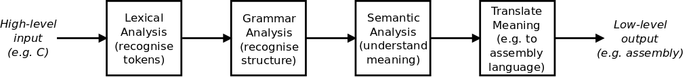

## Part 0 : Introduction

나는 compiler를 작성하는 여정을 떠나기로 결심했다. 과거에 나는 [assemblers](https://github.com/DoctorWkt/pdp7-unix/blob/master/tools/as7)를 썼었고, typeless language를 위해 [simple compiler](https://github.com/DoctorWkt/h-compiler)를 작성했다. 그러나 나는 자기 자신을 컴파일하는 컴파일러를 결코 써본적이 없다. 그래서, 여기에서 나는 이 여정을 떠난다.


## 여행의 목적

여기에 여행을 위한 나의 목표들과 목표들이 아닌 것이 있다.

* self-compiling compiler를 작성하기 위해서. 나는 만약 그 컴파일러가 자기 자신을 컴파일 할 수 있다면, 그것은 그 자체로 *real* compiler라고 부를 수 있다고 생각한다.
* 적어도 하나의 실제 하드웨어 플랫폼을 타겟팅하기 위해서. 나는 가상의 기계를 위한 코드를 생성하는 몇 가지 컴파일러들을 보았다. 나는 나의 컴파일러가 실제 하드웨어에서 작동하기를 원한다. 또한, 만약 가능하다면, 나는 그 컴파일러가 다른 하드웨어 플랫폼들을 위해 여러가지의 백엔드들을 지원할 수 있도록 그것을 작성하고 싶다.
* 리서치 이전에 실용적이게. 컴파일러의 분야에서는 엄청 많은 연구들이 있다. 나는 이 여행에서 완전히 제로 베이스에서 시작하고 싶다.  그래서 나는 실제적인 접근법을 향하는 경향이 있을 것이다, 이론 중심적인 접근법이 아니라. 말해졌듯이, 어떤 이론 기반의 것들을 도입하고 (그리고 구현할) 필요가 있을 시간이 있을 것이다.
* KISS 원칙을 따라라 : 간단하고 멍청하게 유지해라! 나는 명백히 여기에서 Ken Thompson의 원칙을 이용할 것이다 : "의심이 될 때, brute force를 사용해라."
* 최종 목적지를 도달하기 위해 많은 작은 단계를 거쳐라. 나는 나의 여행을 큰 도약을 하는 대신에 많은 작은 단계들로 분할 할 것이다. 이것은 컴파일러에게 새로이 추가하는 것을 한 입 크기의 쉽게 소화가능한 것으로 만들 것이다.


## Target Language

타겟 언어의 선택은 어렵다. 만약 내가 Python, Go 등 같은 high-level 언어를 선택한다면, 그러면 나는 그 언어들에 이미 내장되었듯이, 많은 라이브러리들과 클래스들을 구현해야 할 것이다.

나는 Lisp같은 언어를 위한 컴파일러를 작성할 수 있다. 그러나, 이러한 것들은 쉽게 처리될 수 있다.

대신에, 나는 오래된 것에 다시 빠졌고, 나는 C의 부분을 위한 컴파일러를 작성할 것이다. 그리고 이것은 컴파일러가 그 자신 자체를 컴파일하는데 충분하다.

C는 assembly 언어의 한 단계 위이다 (C의 어떤 subset에 대해, C18은 아니다), 그리고 이것은 C 코드를 어셈블리로 컴파일 하는 일을 어느정도 더 쉽게 만드는데 도움이 될 것이다. 아, 그리고 나는 또한 C를 좋아한다.


## Compiler의 Job 기본

한 컴파일러의 Job은 한 언어에 있는 (보통 high-level language)의 input를 다른 output language (보통 input보다 더 lower-level language)로 변환하는 것이다. 그 주된 단계들은 : 



* 어휘 요소들을 인지하기 위해 [lexical analysis](https://en.wikipedia.org/wiki/Lexical_analysis)(어휘 분석)를 해라. 어떤 언어들에서, `=`는 `==`과 다르다. 그래서 너는 단일의 `=`를 읽어들일 수 없다. 우리는 이러한 어휘 요소(lexical elements)를 *tokens*이라고 부른다.
* input을 [Parse](https://en.wikipedia.org/wiki/Parsing)해라. 즉, syntax(구문, 문법)과 input의 구조적 요소들을 인지해라. 그리고 그것들이 언어의 *grammar*에 순응하는지를 보장해라. 예를들어, 너의 언어는 이러한 의사 결정 구조를 가질지도 모른다:

```c
if (x < 23) {
    print("x is samller than 23\n");
}
```

> 그러나 또 다른 언어에서 너는 다음과 같이 작성할지도 모른다:

```c
if (x < 23):
	print("x is samller than 23\n")
```

> 이것은 compiler가 syntax errors를 탐지할 수 있는 곳이다.  만약 세미콜론이 첫 번째 *print* 문장의 끝에 놓쳐지고 있듯이.

* input의 [semantic analysis](https://en.wikipedia.org/wiki/Semantic_analysis_(compilers)) (의미 분석)을 해라. 즉, input의 의미를 이해해라. 이것은 syntax와 structure를 인지하는 것과 실제로 다르다. 예를들어, 영어에서, 한 문장은 `<subject><verb><adjective><object>`의 형태를 가질지 모른다. 다음의 두 문장들은 같은 구조이지만, 완전히 다른 의미를 가진다:

```
David ate lovely bananas.
Jennifer hates green tomatoes.
```

* 그 input의 의미를 다른 언어로 변환해라. 여기에서, 우리는 한 번에 부분적으로 그 input을 lower-level language로 변환한다.


## Resources

인터넷에는 많은 컴파일러 리소스들이 있다. 여기에 내가 볼 것들이 있다.

**Learning Resources**

만약 너가 어떤 책, 논문, 그리고 컴파일러들에 있는 도구들로 시작하고 싶다면, 나는 이 목록을 매우 추천할 것이다:

* [Curated list of awesome resources on Compilers, Interpreters and Runtimes](https://github.com/aalhour/awesome-compilers) by Ahmad Alhour

**Existing Compilers**

내가 나 자신의 컴파일러를 구축하려고 하는 동안, 나는 아이디어들을 위해 다른 컴파일러들을 볼 계획을 했고, 또한 그것들의 코드를 조금 빌릴 것이다. 여기에 내가 보고 있는 것들이 있다:

- [SubC](http://www.t3x.org/subc/) by Nils M Holm
- [Swieros C Compiler](https://github.com/rswier/swieros/blob/master/root/bin/c.c) by Robert Swierczek
- [fbcc](https://github.com/DoctorWkt/fbcc) by Fabrice Bellard
- [tcc](https://bellard.org/tcc/), also by Fabrice Bellard and others
- [catc](https://github.com/yui0/catc) by Yuichiro Nakada
- [amacc](https://github.com/jserv/amacc) by Jim Huang
- [Small C](https://en.wikipedia.org/wiki/Small-C) by Ron Cain, James E. Hendrix, derivatives by others

특히, 나는 많은 아이디어들과 코드를 SubC compiler에서 사용할 것이다.


## Setting Up the Development Environment

너가 이 여행을 따라 오길 원한다고 가정하여, 여기에 너가 필요할 것이 있다. 나는 Linux 개발 환경을 사용할 것이고, 그래서 너가 가장 좋아하는 리눅스 시스템을 다운로드하고 설정해라: 나는 Lubuntu 18.04이다.

나는 두 개의 하드웨어 플랫폼들을 목표로 할 것이다 : Intel x86-64와 32-bit ARM. 나는 Intel target으로서 Lubuntu 18.04를 작동시키는 한 PC를 사용할 것이고, ARM target으로서 Raspbian을 작동시키는 Raspberry Pi를 사용할 것이다.

Intel 플랫폼에서, 우리는 존재하는 C compiler가 필요할 것이다. 그래서, 이 패키지를 설치해라 (나는 Ubuntu/Debian commands를 준다):

```shell
$ sudo apt-get install build-essential
```

만약 vanilla Linux system을 위해 요구되는 좀 더 많은 도구들이 있다면, 내게 알려주어라.

마지막으로, 이 깃헙 리포지토리의 copy를 clone해라.


## 다음 단계

우리의 compiler writing journey의 다음 파트에서, 우리는 우리의 input file를 scan하고, 우리의 언어의 lexical elements인 *tokens*를 찾는 코드로 시작할 것이다.


